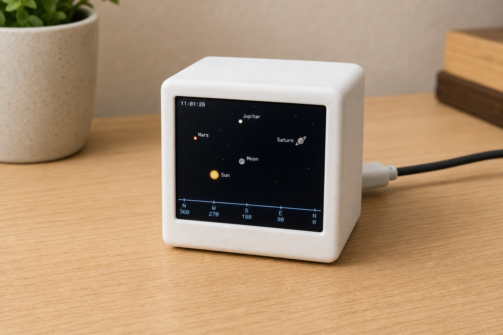
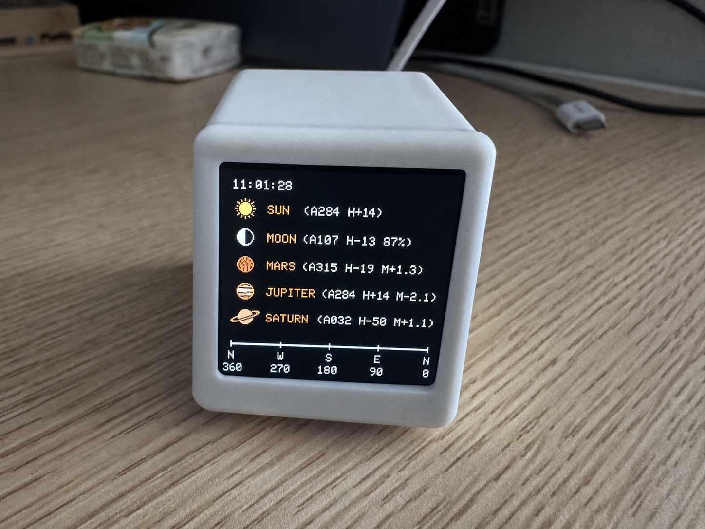

# Micro Star — ESP32-C3 Offline Star Map





An offline, open-source desktop star map for the factory ESP32-C3 and 1.54-inch ST7789 display. It calculates the apparent positions of the Sun, Moon, Mars, Jupiter, and Saturn locally and renders them against a right-to-left azimuth horizon. Saturn is drawn with rings; objects below the horizon are hidden; rising and setting use a short smooth transition.

> These two images are the original concept renders kept unchanged for documentation. Screen text is illustrative; the firmware and pin table are the source of truth.

## English

### Origin and features

This is a factory-hardware port of [AnthonySturdy/micro-radar](https://github.com/AnthonySturdy/micro-radar), an ESP32-C3 desktop flight-radar project. The port retains the upstream project structure, display-adapter workflow, and MIT licence, then adds an offline astronomical display for the tested 12-pin panel.

- Sun, Moon, Mars, Jupiter, and Saturn with azimuth, altitude, and detail fields.
- Saturn marker includes a ring; Mars retains its `M+1.3`-style magnitude field.
- Right-to-left scale: `0/N → 90/E → 180/S → 270/W → 360/N`.
- Horizon at about three-quarters of the 240×240 display.
- Below-horizon bodies are hidden; a 0–4° band animates rising/setting smoothly.
- Collision-checked labels, enlarged upper-left time, and fixed night-only star points.
- Wi-Fi and API access are disabled. Windows sends time over USB serial; calculations run on-device.

### Hardware specification

| Item | Verified configuration |
|---|---|
| MCU | ESP32-C3, single-core 32-bit RISC-V, up to 160 MHz |
| Memory | 320 KB SRAM; 4 MB flash target (`esp32-c3-devkitm-1`) |
| Wireless | 2.4 GHz 802.11 b/g/n Wi-Fi and Bluetooth LE 5 capability; disabled in this firmware |
| USB | Native USB Serial/JTAG for flashing and time synchronisation |
| Display | Factory 1.54-inch, 240×240 TFT, ST7789/ST7789_2 controller |
| Panel | Soldered 12-pin SPI display; no touch controller in this port |
| Logic/power | 3.3 V logic; follow the factory board power design |
| Build | PlatformIO + Arduino-ESP32, C++17 |

#### Verified factory wiring

These pins come from `lib/TFT_eSPI/User_Setup.h` and `include/LGFX.h`; they are not a generic ESP32 wiring rule.

| Signal | GPIO |
|---|---:|
| TFT MOSI / SDA | GPIO5 |
| TFT SCLK / SCL | GPIO3 |
| TFT DC | GPIO2 |
| TFT RESET | GPIO6 |
| TFT backlight | GPIO1 |
| TFT CS | Tied low on the tested board; no GPIO definition |
| VCC / GND | 3.3 V / GND |

Confirm silk labels and cable direction before using another 12-pin display. Two panels both sold as “ST7789” can still differ in reset, backlight, colour order, or offsets.

### Build, flash, and time sync

```text
pio run -e esp32-c3-devkitm-1
pio run -e esp32-c3-devkitm-1 -t upload --upload-port COM3
```

The [`firmware/`](firmware/) folder contains a complete 4 MB recovery image (`micro-star-full-4MB.bin`, address `0x0`), application image (`micro-star-firmware.bin`, address `0x10000`), bootloader, partitions, `boot_app0`, and `SHA256SUMS.txt`.

The device has no battery-backed RTC. On Windows, run `tools/Install-StarTimeAutoSync.cmd` once. The login watcher detects `MICROSTAR` and sends:

```text
SETTIME <unix_seconds> <timezone_offset_minutes>
```

The device replies `TIME_OK`. `tools/StarTimeSync.cmd` is the manual fallback.

### Tests

```text
python -m unittest discover -s tests -v
```

### Attribution and licence

Derived from [AnthonySturdy/micro-radar](https://github.com/AnthonySturdy/micro-radar). Keep the upstream attribution and [MIT License](LICENSE). Astronomical calculations use the bundled [Astronomy Engine](https://github.com/cosinekitty/astronomy) library.

---

## 中文

### 项目简介

这是面向厂家 ESP32-C3 与 1.54 英寸 ST7789 屏幕的离线星图固件，在设备本地计算太阳、月亮、火星、木星和土星的实时方位角与高度角，并显示从右向左的地平线刻度。土星带环；低于地平线的天体隐藏；升起和落下使用平滑过渡。

本仓库移植自 [AnthonySturdy/micro-radar](https://github.com/AnthonySturdy/micro-radar)。原项目是 ESP32-C3 桌面飞机雷达；本项目保留其结构、显示适配工作流和 MIT 许可证，并加入针对实测 12 针 ST7789 屏幕的离线星图功能。

### 功能

- 显示太阳、月亮、火星、木星和土星，以及方位角、高度角和附加信息。
- 土星符号带环；火星保留 `M+1.3` 形式的星等信息。
- 方位轴从右向左：`0/N → 90/E → 180/S → 270/W → 360/N`。
- 地平线位于屏幕约四分之三高度；低于地平线的天体隐藏。
- 穿越地平线时在 0–4° 范围内平滑出现或消失，标签整体防重叠。
- 左上角显示放大的时间，夜间显示固定星点。
- 固件关闭 Wi-Fi 和 API；Windows 通过 USB 串口发送时间，计算在设备本地完成。

### ESP32-C3 与屏幕规格

| 项目 | 已验证配置 |
|---|---|
| 主控 | ESP32-C3，单核 32 位 RISC-V，最高 160 MHz |
| 内存 | 320 KB SRAM；4 MB Flash |
| 无线 | 2.4 GHz Wi-Fi、Bluetooth LE 5；本固件关闭 |
| USB | 原生 USB Serial/JTAG，用于烧录和校时 |
| 显示屏 | 1.54 英寸、240×240 彩色 TFT，ST7789/ST7789_2 |
| 接口 | 焊接 12 针 SPI；本移植未使用触摸 |
| 逻辑/供电 | 3.3 V；遵循厂家电路 |
| 构建 | PlatformIO + Arduino-ESP32，C++17 |

#### 厂家板实测引脚

| 信号 | GPIO |
|---|---:|
| TFT MOSI / SDA | GPIO5 |
| TFT SCLK / SCL | GPIO3 |
| TFT DC | GPIO2 |
| TFT RESET | GPIO6 |
| TFT 背光 | GPIO1 |
| TFT CS | 实测板直接接地，没有 GPIO 定义 |
| VCC / GND | 3.3 V / GND |

更换其他 12 针屏幕前，必须确认丝印和排线方向。“ST7789”屏幕的复位、背光、颜色顺序和偏移量仍可能不同。

### 编译、烧录与校时

```text
pio run -e esp32-c3-devkitm-1
pio run -e esp32-c3-devkitm-1 -t upload --upload-port COM3
```

`firmware/` 目录提供完整 4 MB 恢复镜像 `micro-star-full-4MB.bin`（地址 `0x0`）、应用固件 `micro-star-firmware.bin`（地址 `0x10000`）、引导文件、分区表、`boot_app0` 和 `SHA256SUMS.txt`。

设备没有电池 RTC。Windows 首次运行 `tools/Install-StarTimeAutoSync.cmd` 后，登录任务会监听 `MICROSTAR` 并发送：

```text
SETTIME <Unix秒数> <时区偏移分钟>
```

设备返回 `TIME_OK`；`tools/StarTimeSync.cmd` 可手动校时。

### 测试

```text
python -m unittest discover -s tests -v
```

### 来源、致谢与许可证

本项目基于并移植扩展自 [AnthonySturdy/micro-radar](https://github.com/AnthonySturdy/micro-radar)。再次分发时请保留上游致谢和 [MIT License](LICENSE)。天文计算使用随项目提供的 [Astronomy Engine](https://github.com/cosinekitty/astronomy) 库。
